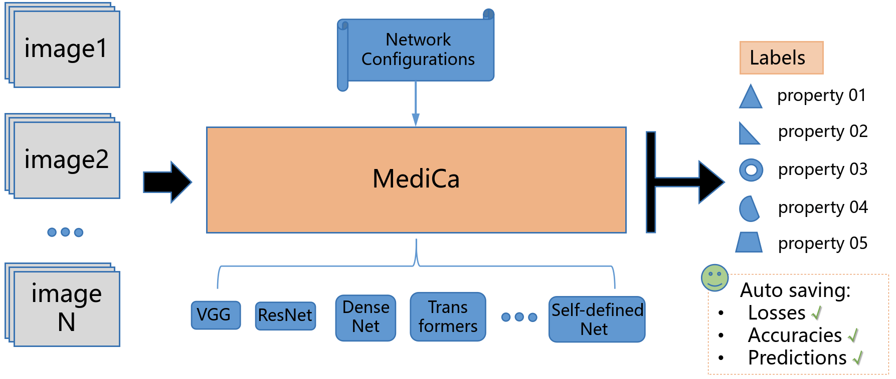

# RRMediCa

#### Description
Ruijin Radiology Medical Imaging Classification Architecture (RRMediCa), designed for 3D medical imaging such as CT and MR, 
supports multi-modal input and multi-target prediction, provides commonly used deep learning network architectures, 
and simplifies the model training and prediction process. It is designed for the 3D medical image classification
scenarios, taking specific needs into consideration to improve research/experiment efficiency.

#### Software Architecture
The image inputs can be one or multiple modalities, depending on the scanning scenario. 
The input region images are stored in the patient folder by designated file names, so that the MediCa could read
 them correctly. You can select and design network architectures easily by changing network configurations.
The predicting targets can also be configured, and the MediCa supports detailed experiment records (losses, accuracies,
predictions). In this way, you can try and compare different networks quickly and make judgement. 


#### Implementation details
The RRMediCa framework adopts the 5-fold cross-validation scheme. By default, the database would be split into 5 folds, 
and it supports training and validation for 5 folds with the least required efforts.


Data augmentations. Due to the limited size of medical data collection and the high annotation cost, RRMediCa framework
employs as thorough augmentations as possible during the training, to maximize the information exploration. Here are some 
augmentation examples for lesion classification,


#### Installation & Usage

```Install the dependencies
pip install -r requirements.txt
```

#### The data format: images and annotation
You should prepare the image data and annotation file before training or testing. The data is organized 
in the following manner: the patient dirs are under the top data-root(train_lesion_crops and test_lesion_crops),
and all the images and the annotation file is under each patient dir. 

```commandline
├── train_lesion_crops
│   ├── RJPD_000_lesion0_17.3mm
│   │   ├── annotations.json
│   │   ├── NM.nii.gz
│   │   └── QSM.nii.gz
│   ├── RJPD_001_lesion0_18.0mm
│   │   ├── annotations.json
│   │   ├── NM.nii.gz
│   │   └── QSM.nii.gz
│   ├── RJPD_004_lesion0_16.7mm
│   │   ├── annotations.json
│   │   ├── NM.nii.gz
│   │   └── QSM.nii.gz

├── test_lesion_crops
│   ├── RJPD_003_lesion0_15.3mm
│   │   ├── annotations.json
│   │   ├── NM.nii.gz
│   │   └── QSM.nii.gz
│   ├── RJPD_007_lesion0_16.0mm
│   │   ├── annotations.json
│   │   ├── NM.nii.gz
│   │   └── QSM.nii.gz
│   ├── RJPD_009_lesion0_18.0mm
│   │   ├── annotations.json
│   │   ├── NM.nii.gz
│   │   └── QSM.nii.gz

```

#### Example annotations.json: 
The top level of the JSON is an ROI dictionary, using id as the key. The contents include:id, tag, 
all predicted variables and their labeled values, list of input imaging modalities, center coordinates for each imaging modality,
ROI core size. If there are multiple predicting targets, then define them in similar conventions, such as
label02, label3... Define different modality combinations in the `nifti_files` variable, keep the list in a string format. The `distance`
variable defines the ROI size (i.e. lesion size) in the image, and RRMediCa would create a mask slice for each modality.

```commandline
{
  "0": {
    "id": "0",
    "tag": "RJPD",
    "label": "0",
    "nifti_files": "['QSM.nii.gz', 'NM.nii.gz']",
    "phy_loc_xyz": "[[99.7, -100.7, 46.7], [99.3, -100.5, 46.6]]",
    "np_loc_zyx": "[[23, 151, 149], [23, 151, 149]]",
    "distance": "16.7 mm"
  }
}
```

Set up the data path and do the training. To try different combinations of the input modalities, modify nifti_files_list
and conduct different rounds of experiments. The database variable specifies the path to image database,
and the data_split_file specifies predefined patient cases in train/val/test splits. MediCa will create a 5-fold
data split if no split file is predefined. The class_names defines the predicting targets for the network. The 
target range will be determined after parsing all the data records (annotations.json in each patient dir).
```set up training path:
    database = '...path/to/train_lesion_crops'
    data_split_file = '...path/to/datasplit_xxx.pkl'
    class_names = ['label', 'label2',... ]
    nifti_files_list = [[...],[...], ...] # different lists of input modalities
```

Start the training:
```Start the training:
python train.py
```

#### Set up the data path and do the testing
During testing, you can specify the predicting inputs and model paths in `test.py` directly. 
Change `database` for the data path, specify the model location  in `ckpts_root` variable.
Use `find_models` function to auto parse all models in `ckpts_root`, or specify models manually.
`ensemble` function aggregate the predictions for each case target, and choose the maximum frequency one. The 
network configurations (i.e. input modalities, network name, outputs) will be loaded for each model automatically.

```set up testing path:
    database = '...path/to/train_lesion_crops'
    ckpts_root = '...path/to/ckpts_root'
    model_keys = ['model1...', 'model2...',... ] # specify the models directly
    
```
Start the testing:
```Start the testing:
python test.py
```


# Self-defined Networks & Projects
## Correlation Routing Network for explainable lesion classification in multi-parametric liver MRIs
The CRN model builds upon the RRMediCa framework. The inputs are the lesion ROIs in liver MR sequences, including T1WI,
T2WI, Late Arterial Phase, Portal Vein Phase, Delay Phase, In Phase, Out Phase, DWI(b=0), DWI(b=1), ADC. The predictions 
are lesion MR imaging features, which are compatible with the [LI-RADS](https://www.acr.org/Clinical-Resources/Clinical-Tools-and-Reference/Reporting-and-Data-Systems/LI-RADS) definitions. The implementation is in models/crn.py.


The liver lesions in Multi-parametric MRIs (sequence order: t1, lap, pv, delay, ip, op, t2, dwi(b0), dwi(b1), adc) 


Liver lesion sample (a HCC):
<div style="display: flex; overflow-x: auto; gap: 5px;">
    
    
    
    
    
    
    
    
    
    
</div>


Liver lesion sample (a Hemangioma):
<div style="display: flex; overflow-x: auto; gap: 5px;">
    
    
    
    
    
    
    
    
    
    
</div>

Liver lesion sample (a Cyst):
<div style="display: flex; overflow-x: auto; gap: 5px;">
    
    
    
    
    
    
    
    
    
    
</div>


Each patient lesion folder contains the ROIs for 10 MR sequences, as well as the imaging feature annotations.
One example input folder is like

```bash
case2102_lesion0_25.4mm/
├── adc.nii.gz
├── annotations.json
├── delay.nii.gz
├── dwi(b0).nii.gz
├── dwi(b1).nii.gz
├── ip.nii.gz
├── lap.nii.gz
├── op.nii.gz
├── preartery.nii.gz
├── pv.nii.gz
└── t2.nii.gz

```


Please note this CRN paper is under submission to the Medical Image Analysis journal (Aug. 2025).


